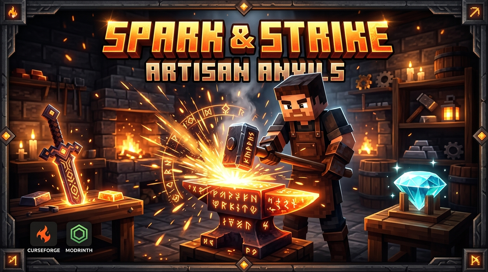
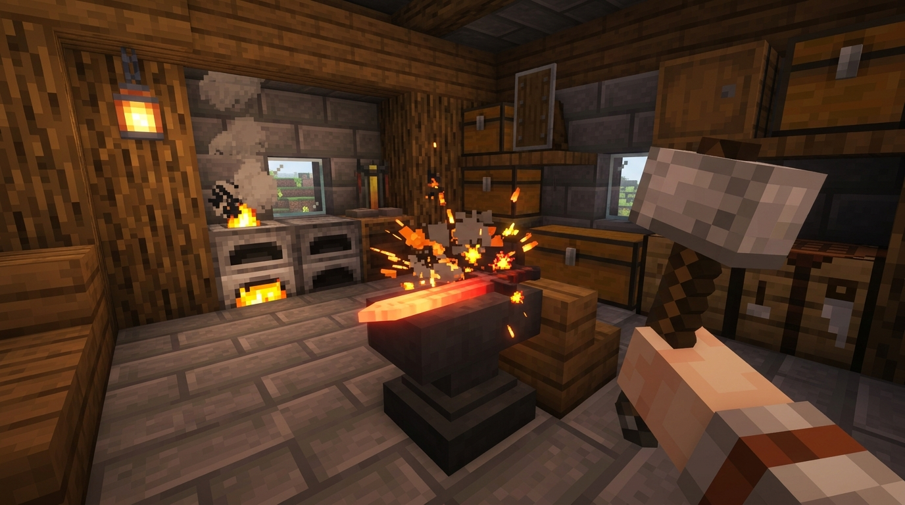
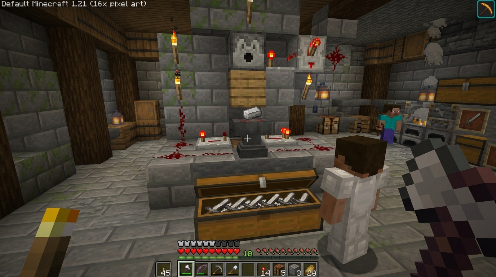

# Spark & Strike: Artisan Anvils



**Tactile, physical, in-world anvil crafting and forge automation for Minecraft 1.21.1 (Fabric).**

---

## 🔨 Overview

**Spark & Strike** replaces boring 2D crafting screens with dynamic, in-world action. Craft stencil blueprints, place them onto the anvil face, load raw ingots and sticks, swing your hammer to strike fiery sparks on every blow, and forge masterwork weapons, tools, and complete armor sets—zero 2D menus!



### Core Features
- **100% Diegetic Interaction**: Zero 2D inventory grids. Pure spatial gameplay coordinated via vanilla 1.21 `ItemDisplayEntity` and `InteractionEntity`.
- **Method 2 Blueprint Smithing**: Place specialized blueprint stencils directly on the anvil face to lock recipes and guide item placement.
- **Full Equipment Suite**:
  - **Weapons & Tools**: Iron Sword, Iron Pickaxe, Iron Axe, Iron Shovel, Iron Hoe.
  - **Armor Sets**: Iron Helmet (5 ingots), Iron Chestplate (8 ingots), Iron Leggings (7 ingots), Iron Boots (4 ingots).
- **Dual-Row Spatial Rendering**: Block Entity Renderer automatically arranges up to 8 secondary items in clean dual rows with real-time elevation and strike wobble.
- **Dynamic Strike Harmonics**: Every tool strike modulates pitch higher until the final resonant strike completes the craft.
- **Sequential Hopper Automation**: Strict recipe sequence filtering and count clamping in `setStack()` prevent hopper overflow and item eating.
- **In-Game Blacksmith's Manual**: Illustrated guide book granted on first world join or craftable with Book + Iron Ingot.
- **Modern Data Components**: Zero legacy NBT (`ItemStack#getTag()`). Dual-channel serialization with Mojang DFU `RecordCodecBuilder` and Netty binary `StreamCodec`.
- **Atomic World Safety**: Breaking the workstation mid-craft cleanly scatters all active workpieces with zero orphan entity leaks.

---

## 📖 How It Works

1. **Obtain a Blueprint**:
   - Craft stencil blueprints using Paper + Iron Ingot / Sticks, or duplicate them on the anvil with Paper.
   - Or consult your in-game **Blacksmith's Manual**.
2. **Mount Blueprint**:
   - Right-click the top of any Vanilla Anvil with your blueprint to anchor the stencil.
3. **Load Ingredients**:
   - Right-click the anvil with the required items (or let Hoppers feed them sequentially):
     - **Sword**: 2 Ingots + 1 Stick
     - **Pickaxe / Axe**: 3 Ingots + 2 Sticks
     - **Shovel**: 1 Ingot + 2 Sticks
     - **Hoe**: 2 Ingots + 2 Sticks
     - **Armor**: Helmet (5), Chestplate (8), Leggings (7), Boots (4)
4. **Work the Metal**:
   - Strike the anvil 3 times with any Pickaxe or Hammer (left-click).
   - Finished items pop off the anvil directly into the world or into collection hoppers below!

---

## ⚙️ Mass-Production Automation Setup



1. **Auto-Loading (Hoppers & Droppers)**:
   - **Hopper**: Point a hopper into the top or side of the anvil. The anvil enforces strict recipe ordering and single-item slot clamping.
   - **Dropper**: Mount an overhead dropper on a redstone pulse clock to feed materials continuously.
2. **Extraction Protection**:
   - Hoppers below the anvil cannot steal unworked ingredients mid-craft.
   - Finished items automatically eject into collection hoppers underneath.

---

## 📦 Compatibility & Toolchain

- **Minecraft**: `1.21.1`
- **Mod Loader**: `Fabric Loader (>=0.16.0)`
- **API**: `Fabric API (>=0.103.0+1.21.1)`
- **Java**: `Java 21 LTS`
- **Gradle**: `8.10` with Fabric Loom `1.7.4`

---

## 🚀 Building & Testing

### Compile & Build Mod Jars
```bash
./gradlew build
```
Compiled binaries are output to `build/libs/k3-diegetic-1.1.0.jar`.

### Run Automated Headless GameTests (35 Tests)
```bash
./gradlew runGameTestServer
```
Executes the headless GameTest server verifying blueprint placement, multi-ingredient sequencing, armor recipes, hopper count clamping, and atomic cleanup across 35 headless tests.

---

## 📜 License

Distributed under the **MIT License**. Free for personal play, modpacks, and content creation.

